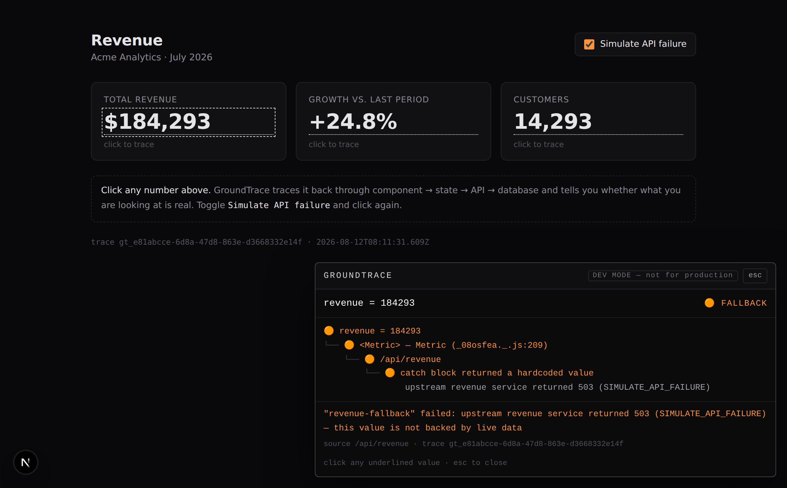
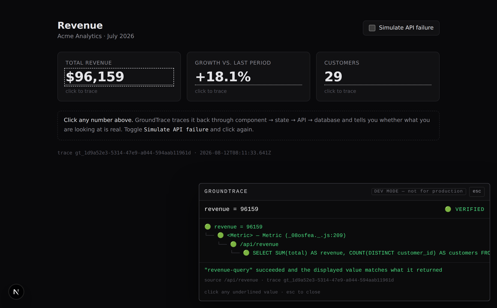

# GroundTrace

**Click a number on your page and see exactly where it came from — including when it quietly came from a `catch` block instead of your API.**

[](LICENSE)
[](package.json)

---

## The 30-second version

Here is a revenue dashboard. It builds cleanly, it renders, its tests pass. Every number on
it is fabricated, and nothing on screen says so.

Click the number, and GroundTrace traces it back through **component → state → API →
database**:



> `revenue = 184293` · 🟠 **FALLBACK** — the API threw, a `catch` block substituted a
> hardcoded constant, and the dashboard rendered it without comment.

Now flip **Simulate API failure** off and click the same number again:



> `revenue = 96159` · 🟢 **VERIFIED** — traced to the real `SELECT SUM(total) …` against
> SQLite, and the number on screen is provably the number the query returned.

Same page. Same click. The only thing that changed is whether the data was real — which is
exactly the thing you could not see before.

---

## Why this exists

Coding agents (Claude Code included) can produce a UI that looks finished — it builds, it
renders, "tests pass ✅" — while a failed request quietly fell back to mock data
underneath. Every signal you normally trust stays green, because none of them are looking at
whether the numbers are real.

GroundTrace makes that gap visible. Every tracked value gets one of five classifications,
and the same status lights mean the same thing in the browser, in the terminal, and in the
docs:

| | Status | Meaning |
|---|---|---|
| 🟢 | `VERIFIED` | A real source succeeded and the displayed value matches what it returned |
| 🟡 | `INDIRECT` | Real source, but the value passed through a named transform on the way to the DOM |
| 🟠 | `FALLBACK` | The source failed — this value came out of a `catch` block |
| 🔴 | `SYNTHETIC` | No source produced it, and its value appears as a literal in your source |
| ⚪ | `UNTRACED` | Displayed, but nothing reported it — GroundTrace has no evidence either way |

The verdicts are auditable, not vibes: every value carries a plain-English `reason`
explaining which rule fired and on what evidence, right down to whether a `VERIFIED`
passthrough was *proven* against a recorded source value or merely assumed.

---

## Install

```bash
npx groundtrace init
```

That writes `groundtrace.config.json`, detecting your project's own dev/build/test scripts.
Add the SDKs you need:

```bash
npm install @groundtrace/node @groundtrace/react @groundtrace/overlay
```

To have Claude Code print a confidence report every time it finishes a task:

```bash
npx groundtrace init --claude-code-hook
```

That merges a `Stop` hook into `.claude/settings.json`, leaving any hooks you already have
untouched. It is informational only — it never blocks Claude's turn.

---

## Two-minute quickstart

Against the bundled demo, from a fresh clone:

```bash
git clone https://github.com/part-time-bros/groundtrace
cd groundtrace
pnpm install
pnpm build

cd examples/dashboard-demo
pnpm dev            # http://localhost:3000
```

Then:

1. The dashboard opens showing **$184,293**. Click it → 🟠 `FALLBACK`.
2. Untick **Simulate API failure**. The figure changes to **$96,159**.
3. Click it again → 🟢 `VERIFIED`, ending at the real SQL query.
4. Click **+18.1%** → 🟡 `INDIRECT`, because it went through `toPercent()`.
5. Press <kbd>Esc</kbd> to close.

From the terminal, without a browser:

```bash
npx groundtrace verify --cwd examples/dashboard-demo --skip-build --skip-tests
```

```
GROUNDTRACE VERIFICATION
━━━━━━━━━━━━━━━━━━━━━━━━━━━━━
Build            ? skipped
Tests            ? skipped
Tracked values   3
  Fallback     3  ⚠ customers, growth, revenue
Confidence       0%
```

…and with the failure switched off, the same command reports `Confidence 100%`.

---

## Using it in your own app

Three additions, all opt-in. Nothing else about your code changes.

**1. Wrap the route handler** (`@groundtrace/node`):

```ts
import { instrumentedGet, recordFallbackValue, traceRoute } from "@groundtrace/node";

export const GET = traceRoute(
  () => {
    try {
      return instrumentedGet(db, "revenue-query", "SELECT SUM(total) AS revenue FROM orders", [], {
        produces: ["revenue"],
        extract: (row) => row as Record<string, unknown>,
      });
    } catch (error) {
      recordFallbackValue("revenue-fallback", DEMO_FALLBACK, String(error));
      return DEMO_FALLBACK;
    }
  },
  { route: "/api/revenue" },
);
```

**2. Mark the displayed value** (`@groundtrace/react`):

```tsx
const revenue = useTruthValue(data?.revenue, { id: "revenue", source: "/api/revenue" });
return <span data-truth-id="revenue">{formatCurrency(revenue)}</span>;
```

**3. Run it** — app, correlation server, and overlay from one command:

```bash
npx groundtrace run
```

### Commands

| Command | Does |
|---|---|
| `groundtrace init` | Scaffolds config into an existing Next.js project |
| `groundtrace run` | Starts the app + collector + overlay injection together |
| `groundtrace verify-tests -- <cmd>` | Runs a test command and reports the real evidence |
| `groundtrace verify` | Build + tests + provenance scan as one confidence report |
| `groundtrace report` | Prints the last `verify` run; `--id revenue` for one value's tree |

---

## How it works

GroundTrace collects two streams of raw observation and joins them on a trace id that rides
along in an `x-groundtrace-id` header:

- **Server side**, `runWithTrace` opens a request-scoped context using Node's built-in
  `AsyncLocalStorage`, and `withTrace` records whether each wrapped call succeeded or threw.
  A failed call is recorded and then **re-thrown** — your own `catch` block still decides
  what the fallback is, which keeps that decision a visible, separate step.
- **Client side**, `useTruthValue` reports each displayed value with its call site, captured
  from `new Error().stack` during render. In a dev build source maps are already on, so the
  frame resolves to your real `.tsx` file.
- **`@groundtrace/core`** stitches the two together into one provenance tree per value and
  classifies it.

**Why an opt-in SDK rather than automatic instrumentation.** The obvious pitch is to
auto-instrument any React app with zero code changes via compiler transforms. That is a real
direction, but a poor first bet: Next.js's default compiler is SWC, and writing a correct
SWC plugin (in Rust) — or reliably injecting a Babel pass across App Router server/client
boundaries — is a multi-week problem *before* any provenance logic exists. V1 ships a small
SDK you call explicitly around values worth tracking. Less magical, buildable, and it still
produces the whole demo above. The full reasoning, including the prior-art survey that found
no existing tool doing per-value provenance with fallback classification, is in
[`docs/BUILD_SPEC.md`](docs/BUILD_SPEC.md).

**This is a dev-mode tool.** The overlay says so on screen. There is no production-safe
mode, no hosted dashboard, and no accounts — see the non-goals in
[`CLAUDE.md`](CLAUDE.md) and the roadmap at the end of the build spec.

---

## Packages

| Package | What it is |
|---|---|
| [`groundtrace`](packages/cli) | The CLI — `init`, `run`, `verify-tests`, `verify`, `report` |
| [`@groundtrace/core`](packages/core) | Correlation, classification, the collector protocol |
| [`@groundtrace/node`](packages/node) | Server SDK — request-scoped tracing, DB/fetch wrappers |
| [`@groundtrace/react`](packages/react) | React SDK — `useTruthValue`, `<Truth>`, `<TraceScope>` |
| [`@groundtrace/overlay`](packages/overlay) | The browser overlay, as a module and a standalone bundle |

## Development

```bash
pnpm install
pnpm build
pnpm test        # 193 tests
pnpm lint
```

`pnpm test` includes an end-to-end check that boots the real demo and runs `groundtrace
verify` against both toggle states. Set `GROUNDTRACE_SKIP_E2E=1` to skip it.

## License

MIT — see [LICENSE](LICENSE).
